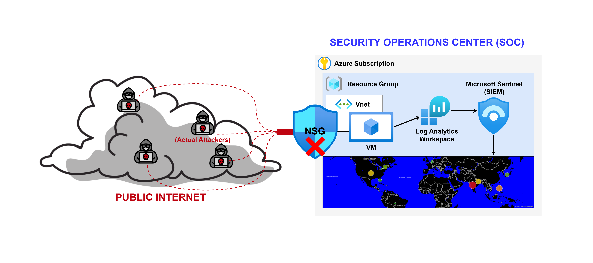
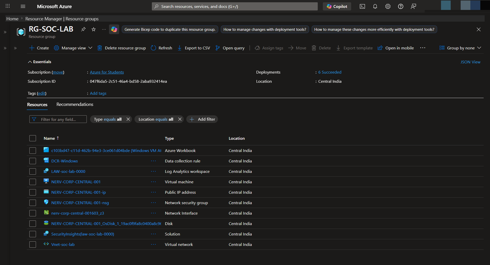
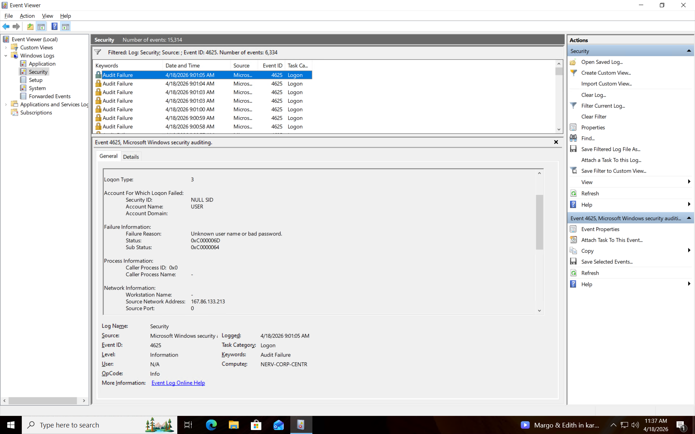
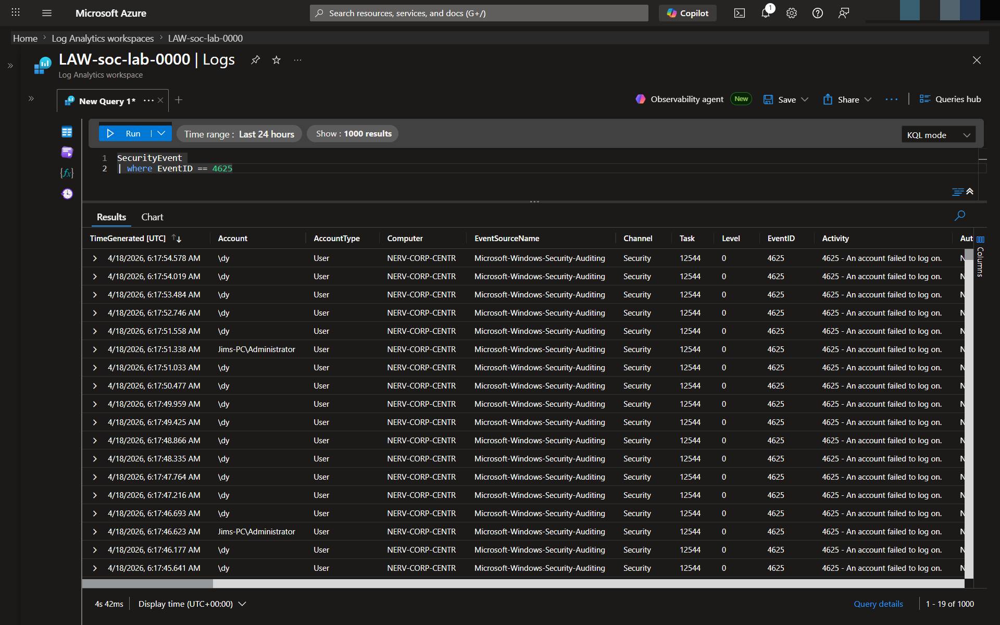
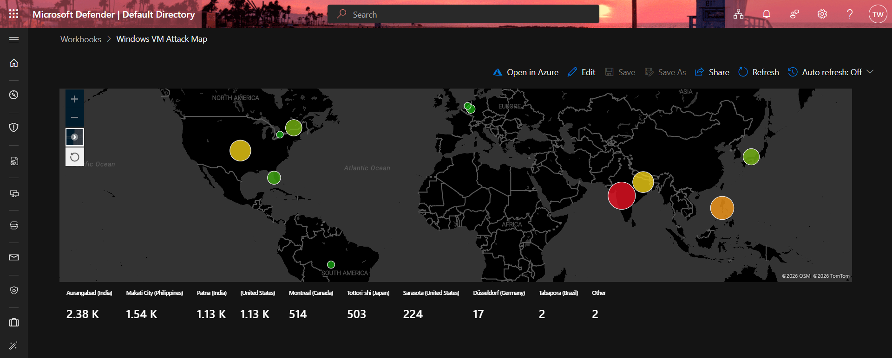

# Azure Cloud SIEM Implementation & Global Honeypot

## 📖 Objective
The Sentinel-Cloud-SIEM-Lab project serves as a hands-on demonstration of Cloud Security Operations. The primary objective was to deploy a globally exposed Windows virtual machine acting as a honeypot, ingest the resulting security telemetry into a centralized log repository, and utilize a Security Information and Event Management (SIEM) system to analyze, parse, and visualize the live cyberattacks occurring from around the world.

This project simulates the foundational responsibilities of a Tier 1 SOC Analyst, emphasizing threat detection, log ingestion pipelines, and proactive monitoring using Microsoft Sentinel.

## 🛠️ Tools & Technologies Used
* **Microsoft Azure:** Cloud infrastructure provisioning (Virtual Machines, Resource Groups, Virtual Networks).
* **Microsoft Sentinel:** Cloud-native SIEM utilized for threat intelligence, log aggregation, and workbook visualization.
* **Log Analytics Workspace (LAW):** Centralized repository for continuous log ingestion.
* **Kusto Query Language (KQL):** Used to parse, filter, and extract meaningful metrics from raw event data.
* **Windows Security Event Logs:** Utilizing Event ID `4625` (Failed Logon) to track malicious authentication attempts.
* **Azure Network Security Groups (NSG):** Configured as a permissive cloud firewall to deliberately expose RDP (Port 3389) to the public internet.

## 🏗️ Architecture & Network Flow

*A visual representation of the data flow from the exposed Honeypot to the Sentinel SIEM.*

1. **Deployment:** A Windows 10 virtual machine was deployed in Azure. Both the Azure Network Security Group and the internal Windows Defender Firewall were intentionally misconfigured to allow indiscriminate inbound traffic from any global IP address.
2. **Ingestion:** The Azure Monitor Agent (AMA) was deployed to the VM to forward Windows Security logs directly into an Azure Log Analytics Workspace.
3. **Enrichment:** A third-party GeoIP mapping watchlist was imported into Microsoft Sentinel to correlate attacker IP addresses with physical geographic locations (Latitude/Longitude, City, Country).
4. **Visualization:** A custom Sentinel Workbook was engineered using KQL to actively plot the geographic origin of incoming brute-force RDP attacks on a live global map.

## 🔍 Implementation Steps

### 1. Honeypot Provisioning & Exposure
A Windows virtual machine was created with a highly vulnerable security posture. The NSG inbound rules were altered to allow `ANY` source to access `ANY` port. To ensure maximum visibility, the internal Windows Firewall profiles (Domain, Private, Public) were completely disabled.

*Ref: Azure Resource Group detailing the VM and permissive NSG.*

### 2. Threat Observation (Raw Telemetry)
Within hours of deployment, global scanners and botnets discovered the exposed asset. By monitoring the local Windows Event Viewer, continuous brute-force attacks were observed.

*Ref: Windows Event Viewer capturing sequential Event ID 4625 (Audit Failure) logs.*

### 3. Log Ingestion & SIEM Integration
A Log Analytics Workspace was established to centralize the telemetry. Microsoft Sentinel was attached to the workspace, and the Windows Security Events connector was configured to stream all security events to the cloud repository. 

*Ref: Querying the `SecurityEvent` table using KQL to verify successful log ingestion.*

### 4. Data Parsing & Geographic Visualization
To extract actionable intelligence, a Geo-IP database was uploaded to Sentinel as a Watchlist. A custom KQL query was authored to join the raw `SecurityEvent` data with the geographic watchlist, mapping the attacker's source IP to their physical coordinates. This data was then fed into a Sentinel Workbook to create a live threat map.

*Ref: The live Microsoft Sentinel Workbook plotting global brute-force attacks.*

## 📈 Key Findings & Conclusion
* **Speed of Discovery:** The honeypot was discovered by automated global scanners within minutes of lowering the firewalls, highlighting the aggressive nature of internet-wide scanning.
* **Primary Attack Vectors:** The vast majority of attacks utilized default or highly predictable administrative usernames (e.g., `admin`, `administrator`, `user`, `root`) confirming that automated brute-force scripts are the primary mechanism for opportunistic RDP compromise.
* **SOC Application:** This lab reinforces the absolute necessity of strict network access controls (Zero Trust), VPN/Bastion host tunneling for administrative access, and the value of a properly tuned SIEM in identifying and triaging network anomalies.
